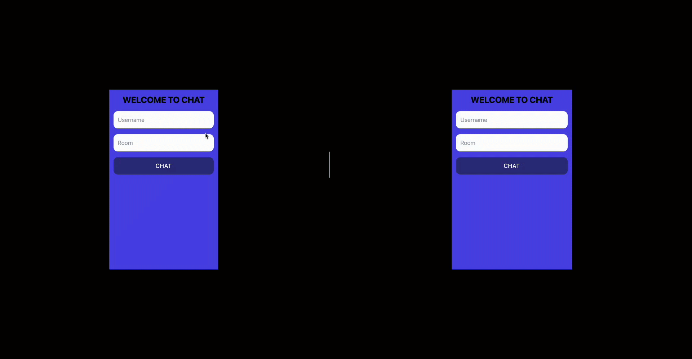

# Real-Time Chat Application

A real-time chat application built with **Socket.io**, **React**, **Node.js**, **Express**, and **TailwindCSS**. Users can join a specific chat room and communicate with each other in real-time across different browser sessions.

## Features

- **Real-time Communication**: Messages are sent and received instantly using Socket.io.
- **Room-based Chat**: Users can join a specific chat room and exchange messages only within that room.
- **Responsive UI**: Styled with TailwindCSS for a sleek and responsive design.

## Technologies Used

### Frontend:
- **React**: ^18.3.1
- **Socket.io-client**: For handling real-time client-server communication.
- **TailwindCSS**: For building a responsive user interface.

### Backend:
- **Node.js**: Server-side environment.
- **Express**: ^4.21.1, for building the REST API.
- **Socket.io**: For real-time, bidirectional communication between clients and server.

# web-socket-io-chatApp
